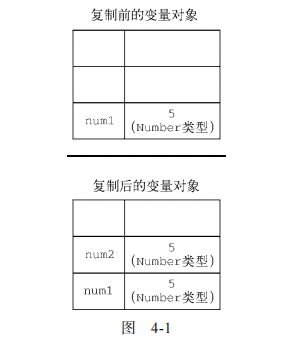
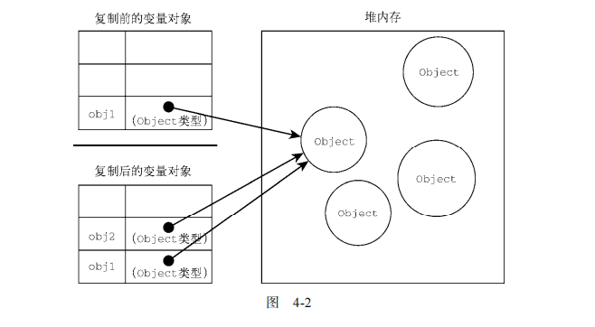

## 原始值与引用值
ECMAScript 变量可以包含两种不同类型的数据：原始值和引用值。原始值（primitive value）就是
最简单的数据，引用值（reference value）则是由多个值构成的对象。


在把一个值赋给变量时，JavaScript 引擎必须确定这个值是原始值还是引用值。上一章讨论了 6 种
原始值：Undefined、Null、Boolean、Number、String 和 Symbol。保存原始值的变量是按值（by 
value）访问的，因为我们操作的就是存储在变量中的实际值。


引用值是保存在内存中的对象。与其他语言不同，JavaScript 不允许直接访问内存位置，因此也就
不能直接操作对象所在的内存空间。在操作对象时，实际上操作的是对该对象的引用（reference）而非
实际的对象本身。为此，保存引用值的变量是按引用（by reference）访问的。

### 动态属性
原始值和引用值的定义方式很类似，都是创建一个变量，然后给它赋一个值。不过，在变量保存了
这个值之后，可以对这个值做什么，则大有不同。对于引用值而言，可以随时添加、修改和删除其属性
和方法。比如，看下面的例子：

```js
let person = new Object(); 
person.name = "Nicholas"; 
console.log(person.name); // "Nicholas" 

```
这里，首先创建了一个对象，并把它保存在变量 person 中。然后，给这个对象添加了一个名为name的属性，并给这个属性赋值了一个字符串"Nicholas"。在此之后，就可以访问这个新属性，直到
对象被销毁或属性被显式地删除。
原始值不能有属性，尽管尝试给原始值添加属性不会报错。比如：

```js
let name = "Nicholas"; 
name.age = 27; 
console.log(name.age); // undefined 
```

在此，代码想给字符串 name 定义一个 age 属性并给该属性赋值 27。紧接着在下一行，属性不见
了。记住，只有引用值可以动态添加后面可以使用的属性。
注意，原始类型的初始化可以只使用原始字面量形式。如果使用的是 new 关键字，则 JavaScript 会
创建一个 Object 类型的实例，但其行为类似原始值。下面来看看这两种初始化方式的差异：

```js
let name1 = "Nicholas"; 
let name2 = new String("Matt"); 
name1.age = 27; 
name2.age = 26; 
console.log(name1.age); // undefined 
console.log(name2.age); // 26 
console.log(typeof name1); // string 
console.log(typeof name2); // object
```
### 复制值

除了存储方式不同，原始值和引用值在通过变量复制时也有所不同。在通过变量把一个原始值赋值
到另一个变量时，原始值会被复制到新变量的位置。请看下面的例子：

```js
let num1 = 5; 
let num2 = num1; 
```

这里，num1 包含数值 5。当把 num2 初始化为 num1 时，num2 也会得到数值 5。这个值跟存储在
num1 中的 5 是完全独立的，因为它是那个值的副本。
这两个变量可以独立使用，互不干扰。这个过程如图 4-1 所示。




在把引用值从一个变量赋给另一个变量时，存储在变量中的值也会被复制到新变量所在的位置。区
别在于，这里复制的值实际上是一个指针，它指向存储在堆内存中的对象。操作完成后，两个变量实际
上指向同一个对象，因此一个对象上面的变化会在另一个对象上反映出来，如下面的例子所示：

```js
let obj1 = new Object(); 
let obj2 = obj1; 
obj1.name = "Nicholas"; 
console.log(obj2.name); // "Nicholas" 
```

在这个例子中，变量 obj1 保存了一个新对象的实例。然后，这个值被复制到 obj2，此时两个变
量都指向了同一个对象。在给 obj1 创建属性 name 并赋值后，通过 obj2 也可以访问这个属性，因为
它们都指向同一个对象。图 4-2 展示了变量与堆内存中对象之间的关系。



### 传递参数

ECMAScript 中所有函数的参数都是按值传递的。这意味着函数外的值会被复制到函数内部的参数
中，就像从一个变量复制到另一个变量一样。如果是原始值，那么就跟原始值变量的复制一样，如果是
引用值，那么就跟引用值变量的复制一样。对很多开发者来说，这一块可能会不好理解，毕竟变量有按
值和按引用访问，而传参则只有按值传递。


在按值传递参数时，值会被复制到一个局部变量（即一个命名参数，或者用 ECMAScript 的话说，
就是 arguments 对象中的一个槽位）。在按引用传递参数时，值在内存中的位置会被保存在一个局部变
量，这意味着对本地变量的修改会反映到函数外部。（这在 ECMAScript 中是不可能的。）来看下面这个
例子：
```js
function addTen(num) { 
 num += 10; 
 return num; 
} 
let count = 20;
let result = addTen(count); 
console.log(count); // 20，没有变化
console.log(result); // 30 
```

这里，函数 addTen()有一个参数 num，它其实是一个局部变量。在调用时，变量 count 作为参数
传入。count 的值是 20，这个值被复制到参数 num 以便在 addTen()内部使用。在函数内部，参数 num


的值被加上了 10，但这不会影响函数外部的原始变量 count。参数 num 和变量 count 互不干扰，它们
只不过碰巧保存了一样的值。如果 num 是按引用传递的，那么 count 的值也会被修改为 30。这个事实
在使用数值这样的原始值时是非常明显的。但是，如果变量中传递的是对象，就没那么清楚了。比如，
再看这个例子：

```js
function setName(obj) { 
 obj.name = "Nicholas"; 
} 
let person = new Object(); 
setName(person); 
console.log(person.name); // "Nicholas" 

```
这一次，我们创建了一个对象并把它保存在变量 person 中。然后，这个对象被传给 setName()
方法，并被复制到参数 obj 中。在函数内部，obj 和 person 都指向同一个对象。结果就是，即使对象
是按值传进函数的，obj 也会通过引用访问对象。当函数内部给 obj 设置了 name 属性时，函数外部的
对象也会反映这个变化，因为 obj 指向的对象保存在全局作用域的堆内存上。

很多开发者错误地认为，
当在局部作用域中修改对象而变化反映到全局时，就意味着参数是按引用传递的。为证明对象是按值传
递的，我们再来看看下面这个修改后的例子：

```js
function setName(obj) { 
 obj.name = "Nicholas"; 
 obj = new Object(); 
 obj.name = "Greg"; 
} 
let person = new Object(); 
setName(person); 
console.log(person.name); // "Nicholas" 
```

这个例子前后唯一的变化就是 setName()中多了两行代码，将 obj 重新定义为一个有着不同 name
的新对象。

当 person 传入 setName()时，其 name 属性被设置为"Nicholas"。然后变量 obj 被设置
为一个新对象且 name 属性被设置为"Greg"。如果 person 是按引用传递的，那么 person 应该自动将
指针改为指向 name 为"Greg"的对象。可是，当我们再次访问 person.name 时，它的值是"Nicholas"，这表明函数中参数的值改变之后，原始的引用仍然没变。

当 obj 在函数内部被重写时，它变成了一个指向本地对象的指针。而那个本地对象在函数执行结束时就被销毁了

### 确定类型
前一章提到的 typeof 操作符最适合用来判断一个变量是否为原始类型。更确切地说，它是判断一
个变量是否为字符串、数值、布尔值或 undefined 的最好方式。如果值是对象或 null，那么 typeof返回"object"，如下面的例子所示：

```js
let s = "Nicholas"; 
let b = true; 
let i = 22; 
let u; 
let n = null; 
let o = new Object(); 
console.log(typeof s); // string 
console.log(typeof i); // number 
console.log(typeof b); // boolean 
console.log(typeof u); // undefined 
console.log(typeof n); // object 
console.log(typeof o); // object 
```

typeof 虽然对原始值很有用，但它对引用值的用处不大。我们通常不关心一个值是不是对象，
而是想知道它是什么类型的对象。为了解决这个问题，ECMAScript 提供了 instanceof 操作符，语
法如下：

`result = variable instanceof constructor`

如果变量是给定引用类型（由其原型链决定，将在第 8 章详细介绍）的实例，则 instanceof 操作
符返回 true。来看下面的例子：
```js
console.log(person instanceof Object); // 变量 person 是 Object 吗？
console.log(colors instanceof Array); // 变量 colors 是 Array 吗？
console.log(pattern instanceof RegExp); // 变量 pattern 是 RegExp 吗？
```
按照定义，所有引用值都是 Object 的实例，因此通过 instanceof 操作符检测任何引用值和
Object 构造函数都会返回 true。类似地，如果用 instanceof 检测原始值，则始终会返回 false，
因为原始值不是对象