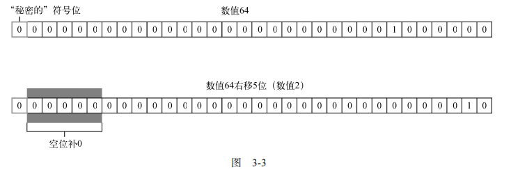

### 位操作符
接下来要介绍的操作符用于数值的底层操作，也就是操作内存中表示数据的比特（位）。ECMAScript
中的所有数值都以 IEEE 754 64 位格式存储，但位操作并不直接应用到 64 位表示，而是先把值转换为
32 位整数，再进行位操作，之后再把结果转换为 64 位。对开发者而言，就好像只有 32 位整数一样，因
为 64 位整数存储格式是不可见的。既然知道了这些，就只需要考虑 32 位整数即可。
有符号整数使用 32 位的前 31 位表示整数值。第 32 位表示数值的符号，如 0 表示正，1 表示负。这
一位称为符号位（sign bit），它的值决定了数值其余部分的格式。正值以真正的二进制格式存储，即 31
位中的每一位都代表 2 的幂。第一位（称为第 0 位）表示 20
，第二位表示 21
，依此类推。如果一个位是空的，则以0填充，相当于忽略不计。比如，数值18的二进制格式为00000000000000000000000000010010，
或更精简的 10010。后者是用到的 5 个有效位，决定了实际的值
```
1 0 0 1 0 =>

1*2*4次幂 + 0*2*3次幂 + 0*2*2次幂 + 1*2*1次幂 + 0*2*0次幂
```
负值以一种称为二补数（或补码）的二进制编码存储。一个数值的二补数通过如下 3 个步骤计算
得到：

(1) 确定绝对值的二进制表示（如，对于18，先确定 18 的二进制表示）；

(2) 找到数值的一补数（或反码），换句话说，就是每个 0 都变成 1，每个 1 都变成 0；

(3) 给结果加 1。
基于上述步骤确定-18 的二进制表示，首先从 18 的二进制表示开始：

0000 0000 0000 0000 0000 0000 0001 0010 

然后，计算一补数，即反转每一位的二进制值：

1111 1111 1111 1111 1111 1111 1110 1101 

最后，给一补数加 1：

1111 1111 1111 1111 1111 1111 1110 1101 

 1 

---------------------------------------------- 

1111 1111 1111 1111 1111 1111 1110 1110 

那么，-18 的二进制表示就是 11111111111111111111111111101110。
要注意的是，在处理有符号整数
时，我们无法访问第 31 位。

ECMAScript 会帮我们记录这些信息。在把负值输出为一个二进制字符串时，我们会得到一个前面
加了减号的绝对值，如下所示：
```js
let num = -18; 
console.log(num.toString(2)); // "-10010" 
```
在将-18 转换为二进制字符串时，结果得到-10010。转换过程会求得二补数，然后再以更符合逻辑
的形式表示出来。

注意 默认情况下，ECMAScript 中的所有整数都表示为有符号数。不过，确实存在无符
号整数。对无符号整数来说，第 32 位不表示符号，因为只有正值。无符号整数比有符号
整数的范围更大，因为符号位被用来表示数值了

在对 ECMAScript 中的数值应用位操作符时，后台会发生转换：64 位数值会转换为 32 位数值，然
后执行位操作，最后再把结果从 32 位转换为 64 位存储起来。整个过程就像处理 32 位数值一样，这让二进制操作变得与其他语言中类似。但这个转换也导致了一个奇特的副作用，即特殊值NaN 和Infinity
在位操作中都会被当成 0 处理。
如果将位操作符应用到非数值，那么首先会使用 Number()函数将该值转换为数值（这个过程是自
动的），然后再应用位操作。最终结果是数值。

#### 1. 按位非
按位非操作符用波浪符（~）表示，它的作用是返回数值的一补数。按位非是 ECMAScript 中为数
不多的几个二进制数学操作符之一。看下面的例子：
```js
let num1 = 25; // 二进制 00000000000000000000000000011001 
let num2 = ~num1; // 二进制 11111111111111111111111111100110 
console.log(num2); // -26 
```
这里，按位非操作符作用到了数值 25，得到的结果是26。由此可以看出，按位非的最终效果是对
数值取反并减 1，就像执行如下操作的结果一样：
```js
let num1 = 25; 
let num2 = -num1 - 1; 
console.log(num2); // "-26" 
```
实际上，尽管两者返回的结果一样，但位操作的速度快得多。这是因为位操作是在数值的底层表示
上完成的。
#### 2. 按位与
按位与操作符用和号（&）表示，有两个操作数。本质上，按位与就是将两个数的每一个位对齐，
然后基于真值表中的规则，对每一位执行相应的与操作。
  
|    第一个数值的位   | 第二个数值的位 | 结 果     |
| ----------- | ----------- | ----------- |
 | 1 | 1 | 1 |  
 | 1 | 0 | 0 |  
 | 0 | 1 | 0 |  
 | 0 | 0 | 0 | 

#### 3. 按位或
按位或操作符用管道符（|）表示，同样有两个操作数。按位或遵循如下真值表：

|    第一个数值的位   | 第二个数值的位 | 结 果     |
| ----------- | ----------- | ----------- |
| 1|  1|  1|  
| 1|  0|  1|  
| 0|  1|  1|  
| 0|  0|  0| 

按位异或与按位或的区别是，它只在一位上是 1 的时候返回 1（两位都是 1 或 0，则返回 0）。
对数值 25 和 3 执行按位异或操作：
```js
let result = 25 ^ 3; 
console.log(result); // 26 
```
可见，25 和 3 的按位异或操作结果为 26，如下所示：

 25 = 0000 0000 0000 0000 0000 0000 0001 1001 

 3 = 0000 0000 0000 0000 0000 0000 0000 0011 

--------------------------------------------- 

XOR = 0000 0000 0000 0000 0000 0000 0001 1010 

两个数在 4 位上都是 1，但两个数的第 0 位都是 1，因此那一位在结果中就变成了 0。其余位上的 1
在另一个数上没有对应的 1，因此会直接传递到结果中。二进制码 11010 等于 26。（注意，这比对同样
两个值执行按位或操作得到的结果小 1。）

#### 5. 左移
左移操作符用两个小于号（<<）表示，会按照指定的位数将数值的所有位向左移动。比如，如果数
值 2（二进制 10）向左移 5 位，就会得到 64（二进制 1000000），如下所示：
```js
let oldValue = 2; // 等于二进制 10 
let newValue = oldValue << 5; // 等于二进制 1000000，即十进制 64
```

注意在移位后，数值右端会空出 5 位。左移会以 0 填充这些空位，让结果是完整的 32 位数值


注意，左移会保留它所操作数值的符号。比如，如果2 左移 5 位，将得到64，而不是正 64。

#### 6. 有符号右移
有符号右移由两个大于号（>>）表示，会将数值的所有 32 位都向右移，同时保留符号（正或负）。
有符号右移实际上是左移的逆运算。比如，如果将 64 右移 5 位，那就是 2：
let oldValue = 64; // 等于二进制 1000000 
let newValue = oldValue >> 5; // 等于二进制 10，即十进制 2 
同样，移位后就会出现空位。不过，右移后空位会出现在左侧，且在符号位之后（见图 3-3）。
ECMAScript 会用符号位的值来填充这些空位，以得到完整的数值



#### 7. 无符号右移
无符号右移用 3 个大于号表示（>>>），会将数值的所有 32 位都向右移。对于正数，无符号右移与
有符号右移结果相同。仍然以前面有符号右移的例子为例，64 向右移动 5 位，会变成 2：
```js
let oldValue = 64; // 等于二进制 1000000 
let newValue = oldValue >>> 5; // 等于二进制 10，即十进制 2 
```
对于负数，有时候差异会非常大。与有符号右移不同，无符号右移会给空位补 0，而不管符号位是
什么。对正数来说，这跟有符号右移效果相同。但对负数来说，结果就差太多了。无符号右移操作符将
负数的二进制表示当成正数的二进制表示来处理。因为负数是其绝对值的二补数，所以右移之后结果变
得非常之大，如下面的例子所示：
```js
let oldValue = -64; // 等于二进制 11111111111111111111111111000000 
let newValue = oldValue >>> 5; // 等于十进制 134217726 
```
在对-64 无符号右移 5 位后，结果是 134 217 726。这是因为-64 的二进制表示是 1111111111111111111 
1111111000000，无符号右移却将它当成正值，也就是 4 294 967 232。把这个值右移 5 位后，结果是
00000111111111111111111111111110，即 134 217 726。